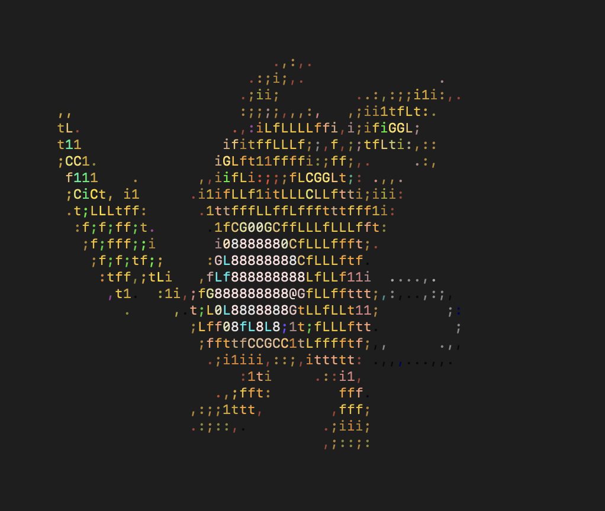

# pokedexProject
<pre>
   __ ___         _            __     ___      ___
   | '_  \       | |           | |    \  \    /  /
   | |_) |  ___  | | _____  ___| |___  \  \  /  /
   | .___/ / _ \ | |/ / _ \/  _  | _ \  \  \/  /
   | |    | (_) ||   <| __/| (_) | __/  /  /\  \
   | |     \___/ |_|\_\___/\_____|___/ /  /  \  \
   |_|                                /__/    \__\
</pre>
This Pokedex project has been updated to include ascii art of all Pokemon as they're searched. If you're on MacOS, there's also some goofy voice action.

I used the PokéAPI for looking up Pokemon in this project. 
It's pretty neat so if you're interested, check that out over at https://pokeapi.co/

The ascii art code is a reimplementation of the "convert" package developed by Qeesung as a part of "Image2Ascii" over at https://github.com/qeesung/image2ascii

UPDATE:
A working sample GoFx microservice webapp is now included under the pokeService directory. The intent here was to see if I could provide the Pokédex terminal experience through a web browser and through and API endpoint so people wouldn't need the binary. 
Unfortunately this was not successful because of the ANSI escape characters that make the colored ASCII possible. That requires the conversion to take place in the client side terminal. Even requesting the data from the API endpoint and displaying the converted ASCII in the local terminal did not fix this.
It's possible that the ANSI color rendering issue could be resolved by converting the string to HTML via "ansi2html" but that would require further abstraction between and hasn't been tested yet (https://github.com/phayes/deadci/blob/master/ansi2html.go).

Additional work:
- Add terminal frames to separate areas of Pokedex content. This will better organize the output.
