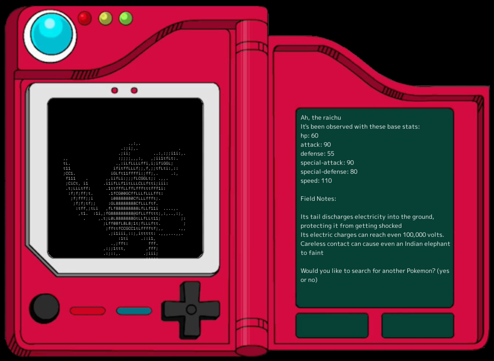

# pokedexProject
<pre>
   __ ___         _            __     ___      ___
   | '_  \       | |           | |    \  \    /  /
   | |_) |  ___  | | _____  ___| |___  \  \  /  /
   | .___/ / _ \ | |/ / _ \/  _  | _ \  \  \/  /
   | |    | (_) ||   <| __/| (_) | __/  /  /\  \
   | |     \___/ |_|\_\___/\_____|___/ /  /  \  \
   |_|                                /__/    \__\
</pre>
The Pokedex generates ascii art of all Pokemon that are searched. If you're on MacOS, there's also some neat goofy voice action!

Use:
- This isn't compiled so you will need to have Golang 1.18 (required due to file embedding feature).
- Go module file go.mod file included may require go mod tidy after fresh pull and Go version update.
- This project can be compiled by either building a binary ("go build main.go") or by running the entry point file ("go run main.go").
- Can be run completely from keyboard inputs. Entering "no" at anytime will exit the program.

I used the PokéAPI for looking up Pokemon in this project. 
It's pretty neat so if you're interested, check that out over at https://pokeapi.co/

The ascii art code is a reimplementation of the "convert" package developed by Qeesung as a part of "Image2Ascii" over at https://github.com/qeesung/image2ascii

The UI framework is Ebitengine, check it out over at https://ebiten.org/

UPDATE:
- Implemented a Pokedex UI.
- Colorization of ascii art in the Pokedex was lost due to text only supporting one color at a time instead of rgb values per character.
- The ascii code still supports colorization. Converting back to an image was explored, but still lost color.
